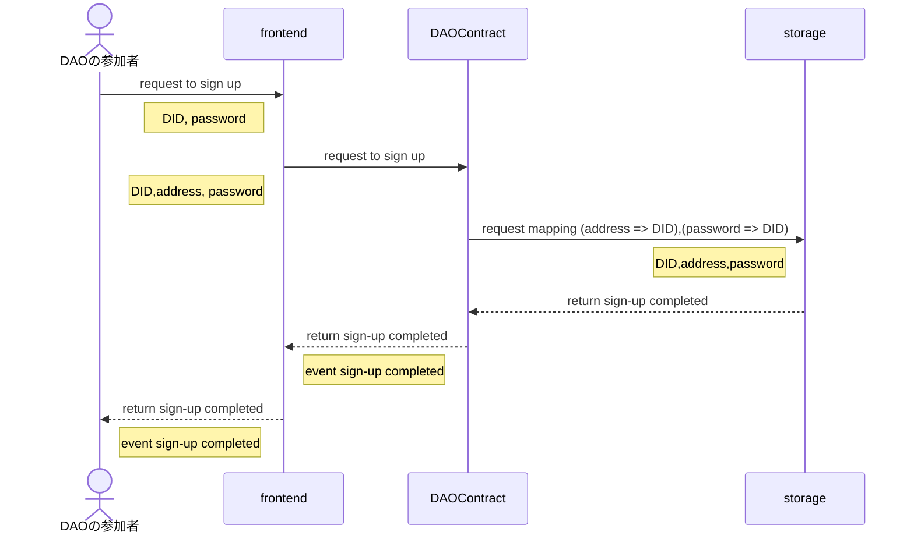
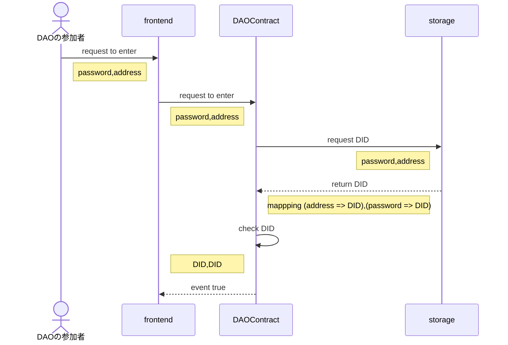

## 分散型検証(Decentralized verification)の為のアプリケーション開発

 
 

# 私達が自らの意思で情報を検証する方法を作りましょう。

 
現在私達が見聞きしている情報は、自分自身の体験から来る要素は意外と少なく、友人とのコミニュケーションや書籍やインターネットから手に入れている事が多いはずです。
それらの事実の検証は出版社や学会などで精査されて信頼を獲得されていきます。
一方で現状の情報の取り扱いについてはいくつか問題点があるのでそれらを列挙していきます。
 
１、出版にかかるコストが高く、そして不明瞭である事。
２、メディアが情報操作をする事によって情報の客観性が失われる。
３、国際法に抵触する事実も国家が検閲する事によって隠蔽される。さらに情報提供者が危険に晒される。
４、SNS にアップロードされる情報は速報性はあってもそれが真実であるかは判断できない。
５、文芸にはならないが名文ではある文章をどのように評価するかが定まっていない。
 
私が考えている課題は、これらの既存の大手メディアが引き受けることが出来ない仕事を誰かが代わりに推敲することはできないだろうか？と言うことでした。
もちろんそれは単純な仕事では無いのですが、少しづつ仕組みを整える事はできるだろうと思い、そのシステムデザインを考えています。
 
方法としては特定のアプリの中で特定の情報を検証するグループを作り、その検証結果を知識人などの第３者が妥当であるかどうかを検証グループと議論してその評価を公開していくと言う仕組みです。
 
ただしそれを公開しただけでは何の信用性を得る事もできないので、その公開が完了した情報を NFT として暗号資産化する事を考えています。
 
この方法のメリットとしてはそれまで特定のメディアで管理されていた情報を第２の機関として個人がチェックできると言う事、それまで評価の対象外だった雑多な文章が別の形で評価できる可能性があるという事、特定の権力の言論の統制からある程度は自由になれるという事があります。
 
もちろんデメリットも存在して、情報の透明性を維持する為に、公開した情報の提供者は彼らの個人情報を開示しなくてはなりません。そうなると政府に抗議する内容や彼ら自身が危険に晒される発表は難しくなります。
またレビュワーがその分野について権威を持つ人物であって、それでも彼の評価が間違っていた場合にその判断を覆す方法を新しく考えなくてはいけないと言う問題点もあります。
 
私は社会にある問題は一つのシステムで解決できないと思っています。だからアプリケーションのシステムデザインもコンポーネント化して随時入れ替えるような形にしたいと考えます。
 
大切な事はコアとなるコンセプトがあって、それを実行する為のメカニズムに執着するべきでは無いと言う事です。
検証の為の情報収集が必要であれば、既存の SNS やコミニュケーションツールを使ってもいいし、再び権威者からの意見を聞いても良いと思っています。
 
 
 
今回私が構想しているシステムの要件は
 
さまざまな場所に点在している各種情報を文章の形で検証していく。
その検証者は特定のメディアや各分野の権威者を頂点としない、しかし彼らを内包する検証システムにする。
それらの検証した内容をやり取りするマーケットを作る。
これまで顧みられなかった未知の貴重な概念を価値づけしていく。
 
もしこれらを実現できるフレームを構築できれば社会に少しだけ新しい価値観を作る事が出来るので、私は緩やかに
それを作っていこうと思います。
 
 
その結果として吟遊詩人に社会的なインセンティブを与える事ができたら面白いと思いませんか？

---

### アイデアの流れ

1. 参加者が DAO に DID を登録する
2. ()DID は外部サービスの使用を検討する（例：https://www.spruceid.com/ ）
3. DAO 参加者が DID によって DAO に入る
4. グループリーダーは DAO 内に何かしらのトピックを検証するグループを作る
5. グループメンバーがトピックを確認する
6. グループメンバーはグループ内でトピックに関する検証を行う（実験、論文の引用など）
7. テーマを検証する期間や手法は各グループ内で打ち合わせながら決めていく。notion や LINE などの外部ツールも自由に使用できる。
8. グループはトピックのレビュワー抽選に参加できる人数、実際のレビュワー人数、レビュワーが立候補できる期間、報酬体系や禁止ルールを設定する
9. ()最後に mint される ERC721 token を public domain にするか著作権を付与するかを設定する。
10. レビュワーが立候補する
11. レビュワーはトピックとその検証に対して興味を持った DAO のメンバーから無作為に選ばれる
12. レビュワーはトークンプールコントラクトに一度トークンを預ける
13. レビュワーとグループでの議論によってトピックと検証内容のレビューを行う → 熟議
14. ()評価を結論づけたレビュワーから決定した内容（文章及び評価値）を投稿していく
15. トークンプールコントラクトがレビュワーへトークンを戻す
16. レビュー終了時、currency コントラクトがレビュワーに ERC20 を mint する（貢献度のよって変動？）
17. mint コントラクトがトピック、検証内容、レビューを ERC721 で mint する
18. ()仕様として１ヶ月あたりに検証するスレッドの数を制限する（例：最大月 1 万件までスレッドを作るとして、その中で一件当たりに配布する ERC20 token を１０とする。発行上限を 5000 万として 1 万 ×10×12×41 なので約４１年稼働出来る。発行数量に半減期を設けるなどして更に調整を考える。
19. ()ERC721 に二次流通によるロイヤリティを付与するかも検討する。

---

### 1. 参加者が DAO に DID を登録する

#### function signUp

DAO に参加するための会員登録

- argument: bytes32 DID, bytes32 password, (address msg.sender)
- operation
  - **DID が既に使われていないか確認**
  - msg.sender と DID を紐付ける
  - password と DID を紐付ける
  - **スタート画面に移動**
- return: nothing

---

### 2. DAO 参加者が DID によって DAO に入る

#### function enterDAO

会員登録した人が DAO に入る

- argument: bytes32 password (address msg.sender)
- operation
  - msg.sender と password に紐づいている DID が一致するか確認
  - event completeToCheckDID
  - **表示画面を切り替える**
- return: nothing

---

### 3. グループリーダーは DAO 内に何かしらのトピックを検証するグループを作る

#### function makeGrouop

DAO に入った人がトピックを検証するグループを作る

- argument: bytes32 topicTitle, bytes32 topicDiscription, address[] groupMem
- operation
  - groupLeader が GroupContract を new する
  - struct Topic に入れていく
  - groupMem のみが Topic に関する検証、参照ができるようにする(modifier onlyMember)
  - struct Topic を address と topicTitle でマッピングする(mapping (topicTitle => (address => Topic)))
  - グループメンバーに NFT を付与
  - event buildTpic (to groupMem, groupLeader, topicTitle)
- return: nothing

---

### 4. グループメンバーがトピックを確認する

#### function checkTopic

グループメンバーがトピックを確認する

- argument: bytes32 topicTitle, address groupLeader
- operation
  - msg.sender が groupMem であるか確認する(modifier onlyMember)
- return: Topic

---

### 5. グループメンバーはグループ内でトピックに関する検証を行う（実験、論文の引用など）

#### function verifyTopic

メンバーが Topic の Verification に検証内容をプッシュする

- argument: bytes32 topicTitle, address groupLeader, bytes32 title, bytes32 discription
- operation
  - msg.sender が groupMem であるか確認する(modifier onlyMember)
  - title,discription を push する
  - event verify(to groupMem, msg.sender, title)
- return: nothing

---

### 6. グループはトピックのレビュワー抽選に参加できる人数、実際のレビュワー人数、レビュワーが立候補できる期間を設定する

#### function setReview

グループリーダーが Topic と紐付いた sturct ReviewSetting に numOfCandidate,numOfReviewer,deadline を push する

- argument: bytes32 topicTitle, uint256 numOfCandidate, uint256 numOfReviewer, uint256 deadline
- operation
  - msg.sender がそのトピックの groupLeader か確認する(mapping に保存されている address かチェック)
  - numOfCadidate,numOfReviewer,deadline を mapping(mapping (topicTitle => (address => Topic)) => ReviewSetting)
  - event recruit(to DAOMember, Topic.topicTitle, Topic.topicDiscription, reviewSetting)
- return: nothing

---

### 7.レビュワーが立候補する

#### function runForReviewer

DAO 参加者があるグルーにおけるトピックのレビュワーとして立候補する

- argument: bytes32 topicTitle, address groupLeader, struct ReviewSetting
- operation
  - msg.sender が groupMem でないことを確認する
  - block.timestamp が reviewSetting.deadline を過ぎていないことを確認する
  - candidateNumber が reviewSetting.numOfCandidate を超えていないことを確認する
  - msg.sender を mapping candidates(uint256 candidateNumber => address msg.sender)する
  - candidateNumber を+1 する
- return: nothing

---

### 8. レビュワーはトピックとその検証に対して興味を持った DAO のメンバーから無作為に選ばれる

#### function selectReviewer

candidates の中から無作為に Review.reviewer に push する

- argument: bytes32 topicTitle
- operation
  - msg.sender が groupLeader であることを確認する
  - block.timestamp が reviewSetting.deadline を過ぎている or candidateNumber が reviewSetting.numOfCandidate と等しい
  - if candidateNumber <= numOfReviewer
    - candidates を Review.reviewer に push する
  - else **乱数の生成 uint256 rand**
    - rand % review numOfReviewer
      > 乱数の生成について調査が必要です
    - candidates から無作為に選ばれた candidateNumber の address を Review.reviwer に push する
  - event SelectedReviewer(to groupMem)
- return: nothing

---

### 8.5 会議用の URL をセットする？

---

### 9. レビュワーはトークンプールコントラクトに一度トークンを預ける

#### function review

reviewer が topicGroup の Contract に ERC20 を預ける

- argument: uint256 currency, bytes32 topicTitle
- operation
  - msg.sender が Review.reviewer であることを確認する
  - 決まった量の ER20(currency)であるか確認する
  - approve
  - transferfrom
  - event Deposit(msg.sender)
- return: bytes32 URL

---

### 10. レビュワーとグループでの議論によってトピックと検証内容のレビューを行う　（他のアプリ使用）

---

### 11. トークンプールコントラクトがレビュワーへトークンを戻す

#### function compliteConference

トークンプールからレビュワーにへトークンを渡す

- argument: bytes32 topicTitle, uint256 ? (それぞれの貢献度)
- operation
  - msg.sender が groupLeader であることを確認する
  - Review.reviewer に預けた ERC20 を返す
  - **それぞれの貢献度をどこかしらに保存**
- return:nothing

---

### 12. レビュー終了時、currency コントラクトがレビュワーに ERC20 を mint する（貢献度のよって変動？）

#### function getCurrency

貢献度によってレビュワーに ERC20 が付与される

- argument: bytes32 topicTitle
- operation
  - msg.sender が reviewer であることを確認する
  - groupLeader によって定められた貢献度とスマコンの計算によって ERC20 の金額を決定
  - approve
  - transferFrom
- return:nothing

---

### 13. mint コントラクトがトピック、検証内容、レビューを ERC721 で mint する

#### function mintTopic

トピックをグループリーダーに mint する

- argument: bytes32 topicTitle
- operation
  - msg.sender が gruopLeader であることを確認する
  - Topic を groupLeader に mint する
- return:nothing

---

struct Topic {
bytes32 topicTitle,
bytes32 topicDiscription,
address[] member,
Verification verification,
Review review
}

struct Verification {
address varifier
bytes32 title,
bytes32 discription
}

struct Review {
bytes32 conferenceURL?
address[] reviewer
}

struct ReviewSetting {
uint256 numOfCandidate
uint256 numOfReviewer
uint256 deadline
}

## DID とは

DID とは分散型の ID

- SSI：管理主体が介在することなく、自分自身が自らのデジタルアイデンティティを保有、コントロールできるという概念
- DID：情報にアクセスするための文字列であり URI の一種である。アクセスすることで DID にリンクされた情報を閲覧可能
- DID ドキュメント：DID とリンクされた情報を指す。この情報は分散管理が可能なアーキテクチャになっている
- Verifiable Credential：個人情報をデジタルに標準化したもの、内容の検証がオンラインで可能なデジタル個人情報
  　クレデンシャルとして個人情報の入力を

xID というマイナンバーと一位に紐つける

市民のコスト
・参加することに関するコスト → 会議に参加することの義務化というコスト
委員会に参加したことよって生じるコスト（労働コスト）
→ 委員会に参加することによるインセンティブが必要になる？
・熟議コスト
ファシリテータの採用などによるコストが生じる（ファシリテータに送る金銭）→ 採用するファシリテータに割くリソースというコスト
→ ファシリテータに対するインセンティブが必要になる
・合意形成によるコスト → 納得感を生み出す力
例えば中規模熟議システムの場合では複数の委員会で会議を行うことで生じる合意形成（複数の委員会を作成する必要があるというコスト）
小規模であれば何度も委員会を繰り返すことによる合意形成(繰り返し会議を行うというコスト)
→ 合意形成というインセンティブ

進捗メモ
・状態遷移図
・アプリで使うシステム
・データの扱い
・評価できない
・IEEE Access にある論文を読むべき

市民が義務的に会議に参加するというコストとファシリテータに割くべきリソースとしてのコストとそれらによって生じる組織の納得感のバランスを評価指標とすべき
